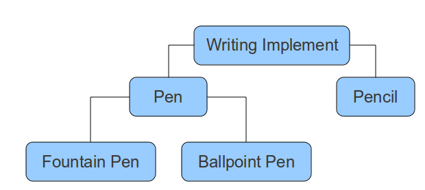

======================================
Terminology used in this documentation
======================================

.. topic:: Overview

	While it is not essential to read this document before proceeding to other
	sections of the documentation, it may help to clarify some of the phrases
	used when talking about general and specific cases.
	
Worked example
==============

Consider the following exmaple:

This graphic illustrates the models that will be used through this documentation
to elucidate how :mod:`djeneralize` works. From this diagram we can define the
following terms:

**General case** or **Generalization**
--------------------------------------

A *Writing Implement* is considered to be the *general case* and is a
*generalization* of all other sub-classes. Additionally, *Pen* is a *general
case* in addition as further :ref:`specializations <specialization>` are
defined (*Fountain Pen* and *Ballpoint Pen*).

.. _specialization:

**Specialization**
------------------

*Pen* and *Pencil* are considered to be specializations of *Writing implement*.
As can be seen from the examples, *Pen* and *Pencil* define extra fields to
supplement the base fields defined on *Writing Implement*.

In addition, *Fountain Pen* and *Ballpoint Pen* are specializations of *Pen*.

Specializations can be categorized into the following sub-categories:

**Final Specialization**
~~~~~~~~~~~~~~~~~~~~~~~~

A final specialization is the most specialized an instance can be. In the
example given *Fountain Pen* and *Ballpoint Pen* are considered to be Final
specializations as indeed is *Pencil*.

**Direct specialization**
~~~~~~~~~~~~~~~~~~~~~~~~~

Conversely a direct specialization is a specialization which is a direct
specialization of a general case. Thus, *Pen* is a direct specialization of
*Writing Implement* and so on.